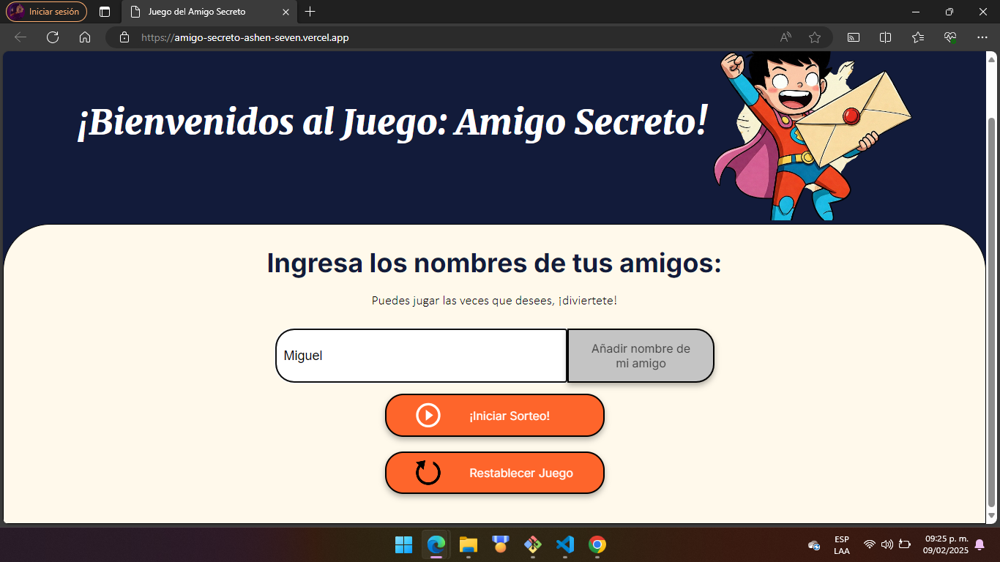
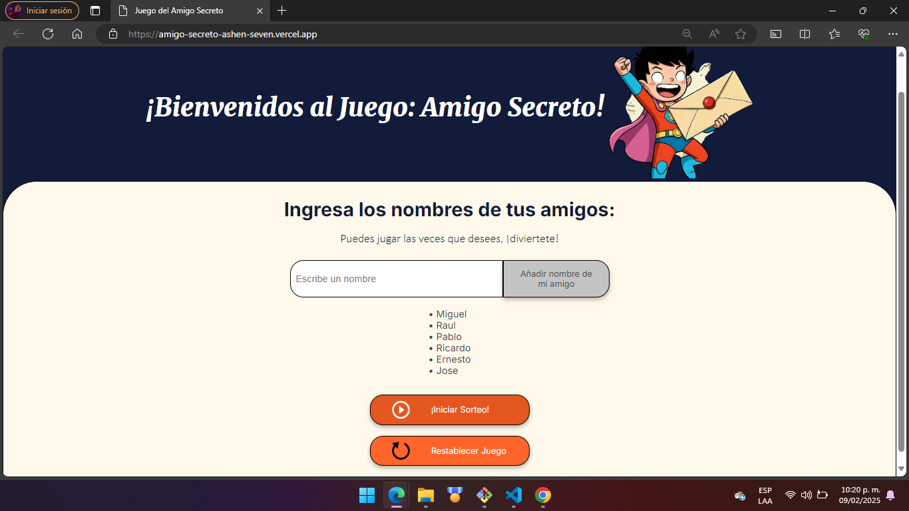
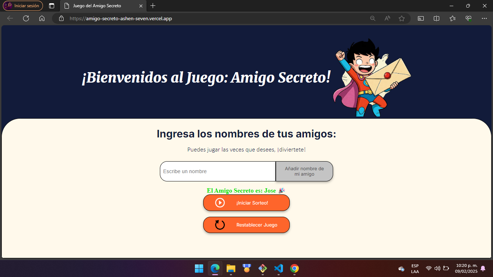
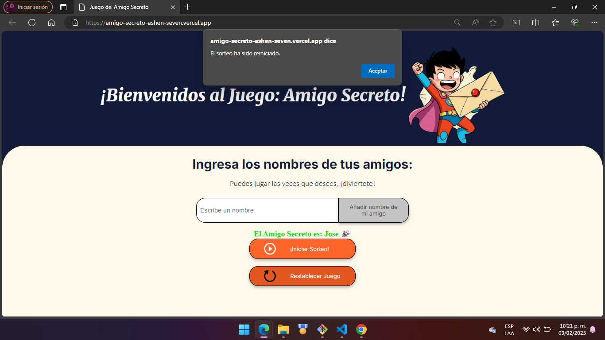
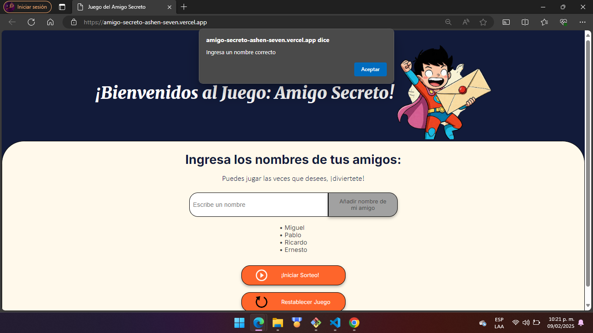
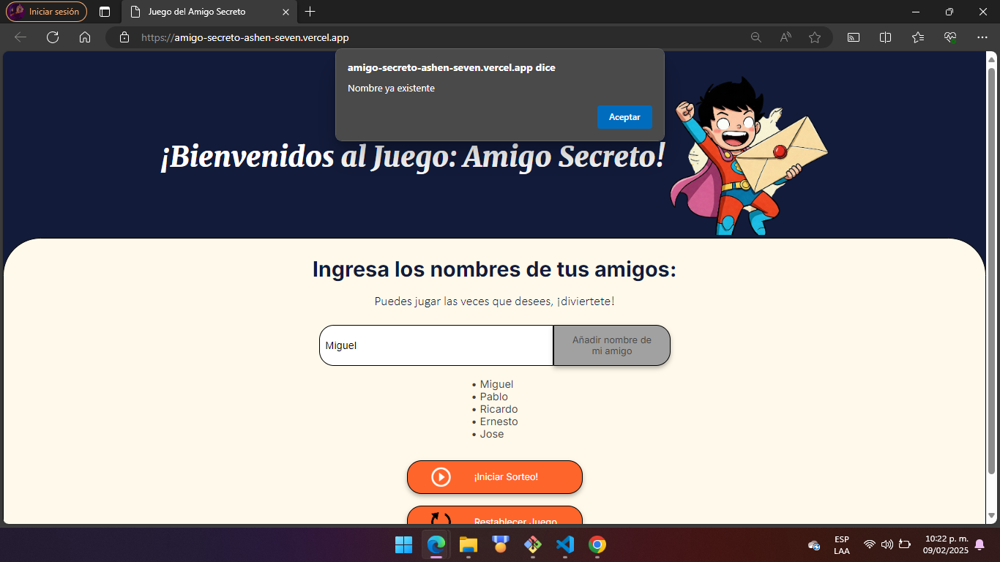

<em> LEEME ANTES DE COMENZAR </em>
<h1 align="center"> Instrucciones del Juego </h1>

   
   

<h2> Descripción del Proyecto </h2>

 Funcionalidades del proyecto

- `Funcionalidad 1`: Accesso mediante Link
- `Funcionalidad 2`: Agregar Nombres de Amigos
- `Funcionalidad 2a`: Lista Ordenada de Amigos Agregados 2
- `Funcionalidad 3`: Sorteo del Amigo Secreto
- `Funcionalidad 4`: Reinicio del Juego
- `Funcionalidad 5`: Condiciones de Uso del Juego

- Para entrar a la interfaz del Juego, ve al siguiente enlace: https://amigo-secreto-ashen-seven.vercel.app/ 🔗

<h3> Ingresando a la Web</h3>

 Una vez en el sitio web: 

- Para comenzar la Diversión, Ingresa los nombres de tus amigos que quieras sortear.

- Ingresa uno por uno insertando el nombre y añadiendolo con el botón 🖱️ que se encuentra a un costado, para que nuestro sistema cree un ¡listado de los nombres de tus amigos!. 📝

- Posteriormente una vez que hayas ingresado varios nombres de tus amigos, ¡puedes sortear a tu amigo secreto!
🖱️ Solo da click en ¡Iniciar Sorteo! 🖱️

- Al dar click en ¡Iniciar Sorteo!, Inmediatamente nuestro sistema te revelara a tu ¡Amigo Secreto!. 🖥️

- 🔄¡Puedes jugar las veces que desees, reiniciando el juego con el botón que lo indica!🔄

- Aparecerá una Alerta, que te indica cuando tu juego se ha restablecido.

<h3> ¡IMPORTANTE! </h3>

- Existen dos condiciones que debes de respetar, de caso contrario el sistema te mostrará una alerta

- Primera condicion: NO se puede intentar agregar campo vacio en el ingreso de nombre, por lo que te mostrará una alerta con instrucciones claras de uso. Ejemplo:

- Segunda Condición: No se pueden agregar nombrees repetidos, de lo contrario el sistema te mostrará una alerta como en siguiente ejemplo:

<h3> Es un placer para nosostros que puedas imteractuar con nuestro sistema por lo que deseamos diversión en este Juego Dinamico de Azar. Recuerda que puedes jugar las veces que desees, ¡descubre las posibilidades con este juego de sorteo!</h3>

<h2> Autores del Proyecto </h2>

- BangalterCrown